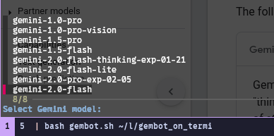
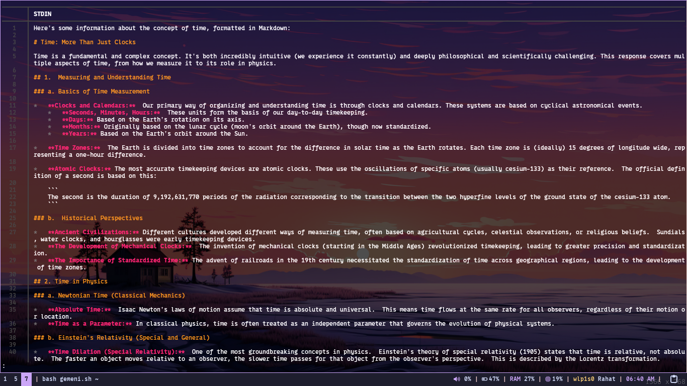

# gembot_on_terminal

 put ur api key from https://aistudio.google.com/ to the code var name where it says to put key . its free also make sure u have fzf and bat google how to install (linux / mac idk about windows but ig u can try without the fzf ( need to change code) idk and idc ) 
